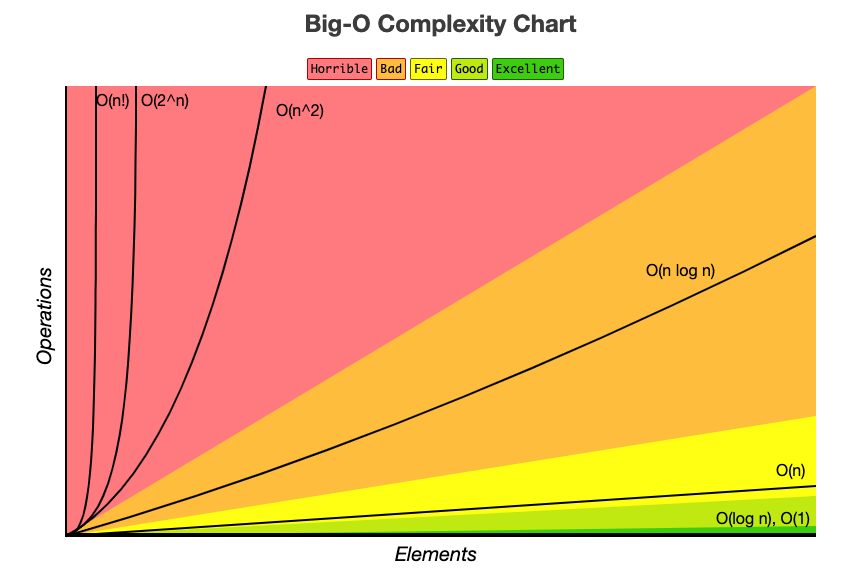

# 시간 복잡도(Time Complexity)와 공간 복잡도(Space Complexity)

코딩 테스트 문제를 풀 때, 시간 제한과 메모리 제한이 있는 경우가 있다.

예를 들어, 시간 제한 `2초`, 메모리 제한 `128MB` 등의 제한이 있을 수 있다.

이런 경우 생각한 문제 풀이 방법이 시간 제한/메모리 제한을 통과 할 수 있는지 알수 있어야한다.

따라서, `시간 복잡도`와 `공간 복잡도`에 대해 정리하려 한다.

## `시간 복잡도(Time Complexity)`
일반적으로, `1초 = 1억번 연산`을 한다고 한다.

따라서, 위 예시의 시간 제한 2초는 즉, 2억번 연산안에 끝나는 코드를 짜야한다고 이해할 수 있다.

시간 복잡도란, `입력의 크기와 문제를 해결하는데 걸리는 시간의 상관 관계`를 말한다.

또한, 이러한 시간복잡도를 표현하기 위해 `빅오 표현법(Big-O Complexity)`이 대표적으로 사용된다.



위 사진을 보면 

$
O(1) < O(\log N) < O(N) < O(N\log N) < O(N^2) < O(2^N) <O(N!)
$ 

순서로 시간이 오래 걸린다는 것을 알 수 있다.

N의 크기에 따른 `제한시간 1초 기준` 허용 시간 복잡도를 계산한 표를 작성하자면 다음과 같다.
|$N$|허용 시간 복잡도|
|------|---|
|$N <= 11$|$O(N!)$|
|$N <= 25$|$O(2^N)$|
|$N <= 100$|$O(N^4)$|
|$N <= 500$|$O(N^3)$|
|$N <= 3,000$|$O(N^2\log N)$|
|$N <= 5,000$|$O(N^2)$|
|$N <= 1,000,000$|$O(N\log N)$|
|$N <= 10,000,000$|$O(N)$|
|$N > 10,000,000$|$O(\log N), O(1)$|

### `코드에 따른 시간 복잡도 예시`
### 1. $O(N)$
```java
public int func(int N){
    int ret = 0;

    // i = 1 .. N 까지 반복하므로 N 번 수행
    for (int i=1; i<= N; i++>){
        if (i % 3 == 0 || i % 5 == 0) ret += i;
    }

    return ret;
}
```

### 2. $O(N^2)$
``` java
public int func(int[] arr, int N){

    // N-1, N-2, ... , 2, 1 번 수행하므로 O(N^2)
    for (int i=0; i<N; i++) {
        for (int j=i+1, j<N; j++){
            if(arr[i] + arr[j] == 100) return 1;
        }
    }
    return 0;
}
```

### 3. $O(\sqrt N)$
```java
public int func(int N){
    // 1, 4, 9..., sqrt(N)까지 반복하므로
    for (int i=1; i*i <= N; i++>){
        if (i*i == N) return 1;
    }
    return 0;
}
```


## `공간 복잡도(Space Complexity)`
입력의 크기와 문제를 해결하는데 필요한 공간의 상관 관계

대부분, 공간 복잡도 문제보다는 시간 복잡도의 문제로 틀리게 된다.

`512MB = 1.2억개의 int`, `int = 4Byte` 를 기억하자.

### `Reference`
[빅오 표기법](https://www.bigocheatsheet.com)

[바킹독의 실전 알고리즘 0x01강 - 기초 코드 작성 요령 I](https://blog.encrypted.gg/724)
