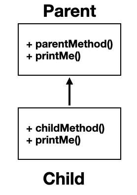

# Polymorphism (다형성)
- 다형성은 이름 그대로 `다양한 형태`, `여러 형태`를 뜻한다.
- 보통 하나의 객체는 하나의 타입으로 고정되어 있다. 하지만 다형성을 사용하면 하나의 객체가 다른 타입으로 사용될 수 있다.

다형성을 이해하기 위해서는 다음 두 가지 핵심 이론을 알아야 한다:
- 다형적 참조
- 메소드 오버라이딩

## 참조, 다형적 참조와 오버라이딩
> 중요 개념!! 부모는 자식을 품을 수 있다.

- Child 클래스가 Parent 클래스를 아래처럼 상속한다고 가정하자.
```java
class Parent {
    public void parentMethod() {
        System.out.println("Parent.parentMethod");
    }
    public void printMe(){
        System.out.println("Parent.printMe");
    }
}

public class Child extends Parent {
    public void childMethod() {
        System.out.println("Child.childMethod");
    }
    @Override
    public void printMe() {
        System.out.println("Child.printMe");
    }
}
```

위를 이미지로 나타내면 다음과 같다.

<div style="text-align: center;">
    
</div>

- 부모 클래스는 2개의 메소드를 가지고 자식 클래스는 부모 클래스를 상속하고 한 개의 메소드를 정의하고 `printMe()`를 오버라이딩 한다.


### 1. 부모 타입 변수가 부모 인스턴스 참조
```java
public static void main(String[] args) {
    //부모 변수가 부모 인스턴스 참조 
    System.out.println("Parent -> Parent");
    Parent parent = new Parent();
    parent.parentMethod();
    parent.printMe();
}
```
> 실행결과
``` bash
Parent -> Parent
Parent.parentMethod
Parent.printMe
```
### 2. 자식 타입 변수가 자식 인스턴스 참조
```java
public static void main(String[] args) {
    //자식 변수가 자식 인스턴스 참조 
    System.out.println("Child -> Child");
    Child child = new Child();
    child.childMethod();
    child.printMe();
}
```
> 실행결과
``` bash
Child -> Child
Child.childMethod
Child.printMe
```
### 3. 다형적 참조: 부모 타입의 변수가 자식 인스턴스 참조
```java
public static void main(String[] args) {
    //부모 변수가 자식 인스턴스 참조(다형적 참조)
    System.out.println("Parent -> Child");
    Parent poly = new Child(); // 가능!!
    poly.parentMethod();
    poly.printMe(); // 오버라이딩에 의해 Child의 메소드 호출
    poly.childMethod(); // 에러 발생
}
```
> 실행결과
``` bash
Parent -> Child
Parent.parentMethod
Child.printMe
에러 발생
```
`부모 타입은 자식 인스턴스를 품을 수 있다!!`
추가로, 부모 타입 변수로는 Child 클래스에 정의된 메소드에 접근 할 수 없다. `(오버라이딩 된 메소드가 아닌 이상)`

#### 이를 해결하려면 자식 타입으로 캐스팅해야 한다 `다운캐스팅`:
```java

public static void main(String[] args) {
    Parent poly = new Child();
    poly.parentMethod();
    poly.printMe();
    ((Child) poly).childMethod(); // 캐스팅을 통해 호출 가능
}
```
### 4. 자식 타입의 변수가 부모 인스턴스 참조
``` java
public static void main(String[] args) {
    //자식 변수가 부모 인스턴스 참조
    System.out.println("Child -> Parent");
    Child poly = new Parent(); // 컴파일 에러
    poly.parentMethod(); // 위에 따른 실행 불가
    poly.printMe(); // 위에 따른 실행 불가
}
```
> 실행결과
```bash
컴파일 에러
```
`자식 타입은 부모 인스턴스를 담을수 없다.`

## Reference
[인프런-김영한의-실전-자바-기본편](https://www.inflearn.com/course/%EA%B9%80%EC%98%81%ED%95%9C%EC%9D%98-%EC%8B%A4%EC%A0%84-%EC%9E%90%EB%B0%94-%EA%B8%B0%EB%B3%B8%ED%8E%B8)