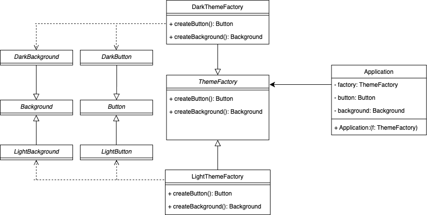

# 추상 팩토리 패턴(Abstract Factory Pattern)

## 0. 추상 팩토리 패턴

- 추상 팩토리 패턴은 구체적인 클래스에 의존하지 않고 `관련된 객체들을 생성할 수 있는 인터페이스를 제공`, 이는 객체 생성의 구체적인 클래스를 숨기고, 객체들의 집합을 관리할 수 있도록 한다.

## 1. 코드 예제

- 어떤 어플리케이션이 있고, 다크모드를 지원한다고 가정
- UI 요소들 (예를들어, 버튼, 배경)의 기능은 유사하나 모드에 따라 보이는 것이 다름
- 모드에 따라 추상팩토리 패턴을 적용하여 UI 객체 생성

## 1.1 다이어그램



- UI 인터페이스
    - `Background`, `Button`
- ThemeFactory 추상 팩토리
    - 서브 클래스(`DarkThemeFactory`, `LightThemeFactory`에 따라 UI 인터페이스의 서브클래스 결정

## 1. 2 UI 추상 클래스, 서브 클래스

```java
// 버튼과 배경의 추상화
public interface Button {
    void render();
}

public interface Background {
    void apply();
}

// 다크 모드 구현
public class DarkButton implements Button {
    @Override
    public void render() {
        System.out.println("Rendering Dark Button");
    }
}

public class DarkBackground implements Background {
    @Override
    public void apply() {
        System.out.println("Applying Dark Background");
    }
}

// 라이트 모드 구현
public class LightButton implements Button {
    @Override
    public void render() {
        System.out.println("Rendering Light Button");
    }
}

public class LightBackground implements Background {
    @Override
    public void apply() {
        System.out.println("Applying Light Background");
    }
}
```

## 1.3 추상 팩토리, 모드에 따른 서브클래스

```java
// 추상 팩토리
public interface ThemeFactory {
    Button createButton();
    Background createBackground();
}

// 다크 모드 팩토리
public class DarkThemeFactory implements ThemeFactory {
    @Override
    public Button createButton() {
        return new DarkButton();
    }

    @Override
    public Background createBackground() {
        return new DarkBackground();
    }
}

// 라이트 모드 팩토리
public class LightThemeFactory implements ThemeFactory {
    @Override
    public Button createButton() {
        return new LightButton();
    }

    @Override
    public Background createBackground() {
        return new LightBackground();
    }
}
```

## 1. 4 클라이언트 코드

```java
// 클라이언트 코드
public class Application {
    private Button button;
    private Background background;

    public Application(ThemeFactory factory) {
        this.button = factory.createButton();
        this.background = factory.createBackground();
    }

    public void renderUI() {
        button.render();
        background.apply();
    }

    public static void main(String[] args) {
        ThemeFactory darkFactory = new DarkThemeFactory();
        Application darkApp = new Application(darkFactory);
        darkApp.renderUI();

        ThemeFactory lightFactory = new LightThemeFactory();
        Application lightApp = new Application(lightFactory);
        lightApp.renderUI();
    }
}
```

- `Application` 는 추상팩토리(`ThemeFactory` )를 통해 UI 요소 생성하여 다크 모드와 라이트 모드 지원가능!

## 2. 추상 팩토리 장단점

- 장점
    - 팩토리에서 생성되는 클래스의  상호 호환 보장
    - 결합도를 낮출 수 있음.
    - SRP 준수 → 추상 팩토리를 통해 서브클래스 생성
    - OCP 준수 → 기존 클라이언트 코드를 훼손하지 않고 확장 가능
        - 예를 들어, 다른 테마를 지원하기 위해 새로운 `Button`, `Background`, `ThemeFactory` 의 서브 클래스를 생성하면 가능
- 단점
    - 추상 팩토리 패턴을 위한 새로운 인터페이스와 클래스의 많은 생성 필요하므로 코드가 필요이상으로 복잡해질 수 있다.
        - 지원하는 테마가 하나씩 늘어날때마다, 위 예제만 하더라도 3개의 클래스를 구현해야한다.

## Reference

- https://refactoring.guru/ko/design-patterns/abstract-factory