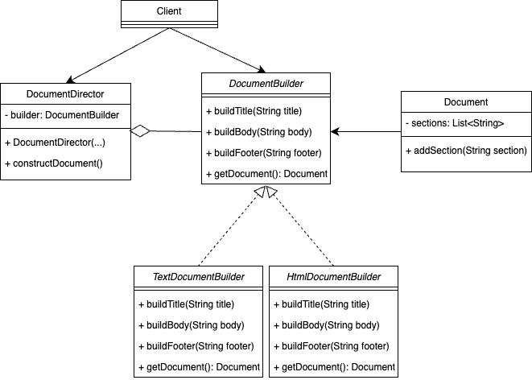

# 빌더 패턴(Builder Pattern)

## 0. 빌더 패턴

- 복잡한 객체를 단계별로 생성 할 수 있도록 하는 생성 디자인 패턴

## 1. 사용 시기

- 복잡한 객체 생성
    - 객체의 생성과정이 복잡하고 많은 매개 변수를 필요로 할때
- 다양한 표현
    - 동일한 객체의 다양한 표현을 제공할 때
- 불변 객체
    - 객체가 생성된 후 수정되지 않아야 할 때

## 2. 예제 코드

- 문서 작성 시나리오

## 2.1. 다이어그램



## 2.2. Product - 문서

- 각 세션을 저장하고 출력하는 문서 클래스

```java
import java.util.ArrayList;
import java.util.List;

public class Document {
    private List<String> sections = new ArrayList<>();

    public void addSection(String section) {
        sections.add(section);
    }

    @Override
    public String toString() {
        return String.join("\n", sections);
    }
}
```

## 2.3. Builder - 문서 빌더 인터페이스

- 제목, 본문, 바닥글을 구성하기 위한 인터페이스

```java
public interface DocumentBuilder {
    void buildTitle(String title);
    void buildBody(String body);
    void buildFooter(String footer);
    Document getDocument();
}
```

## 2.4. ConcreteBuilder - 구체적인 문서 빌더

- DocumentBuilder 인터페이스를 구현하여 각각 텍스트, HTML 기반 문서 생성

```java
public class TextDocumentBuilder implements DocumentBuilder {
    private Document document = new Document();

    @Override
    public void buildTitle(String title) {
        document.addSection("Title: " + title);
    }

    @Override
    public void buildBody(String body) {
        document.addSection("Body: " + body);
    }

    @Override
    public void buildFooter(String footer) {
        document.addSection("Footer: " + footer);
    }

    @Override
    public Document getDocument() {
        return document;
    }
}

public class HtmlDocumentBuilder implements DocumentBuilder {
    private String title;
    private String body;
    private String footer;

    @Override
    public void buildTitle(String title) {
        this.title = "<title>" + title + "</title>";
    }

    @Override
    public void buildBody(String body) {
        this.body = "<body>" + body + "</body>";
    }

    @Override
    public void buildFooter(String footer) {
        this.footer = "<footer>" + footer + "</footer>";
    }

    @Override
    public Document getDocument() {
        String htmlContent = "<html>" +
                "<head>" + title + "</head>" +
                body +
                footer +
                "</html>";
        Document document = new Document();
        document.addSection(htmlContent);
        return document;
    }
}
```

## 2.5. Director - 문서 작성 관리자

- 문서 빌더를 사용하여 문서의 구조를 정의하고 구성

```java
public class DocumentDirector {
    private DocumentBuilder builder;

    public DocumentDirector(DocumentBuilder builder) {
        this.builder = builder;
    }

    public void constructDocument() {
        builder.buildTitle("Document Title");
        builder.buildBody("This is the body of the document.");
        builder.buildFooter("Document Footer");
    }
}
```

## 2.6 Client - 클라이언트 코드

- `DocumentDirector` 와 `DocumentBuilder` 를 사용하여 문서를 생성하고 출력

```java
public class Main {
    public static void main(String[] args) {
    
		// Text
        DocumentBuilder builder = new TextDocumentBuilder();
        DocumentDirector director = new DocumentDirector(builder);

        director.constructDocument();

        Document document = builder.getDocument();
        System.out.println(document);
        
        //Html
        builder = new HtmlDocumentBuilder();
        director = new DocumentDirector(builder);

        director.constructDocument();

        document = builder.getDocument();
        System.out.println(document);
    }
}
```

## 3. 빌더 패턴의 장단점

- 장점
    - 객체들을 단계별로 생성하거나 생성 단계들을 연기하거나 재귀적으로 단계를 생성할 수 있다.
    - Product의 다양한 표현을 만들 때 같은 생성 코드를 재사용 가능
    - SRP 준수, 제품의 비지니스 로직에서 복잡한 생성 코드를 고립시킬 수 있다.
- 단점
    - 패턴이 여러개의 새 클래스들을 생성해야 하므로 코드의 전반적인 복잡성이 증가한다.

## 4. 결론

- GOF의 빌더 패턴에 대해 공부 해보았다.
    - 디렉터 빌더 패턴이라고 하는듯? 더 공부해봐야할 부분
- 심플 빌더 패턴(GOF 빌더 패턴과 구분하기 위해 이렇게 부른다 한다.)
    - LomBok의 @Builder가 심플 빌더 패턴이다. 이쪽도 한번 공부해봐야할 것 같다.

## Reference

- https://refactoring.guru/ko/design-patterns/builder