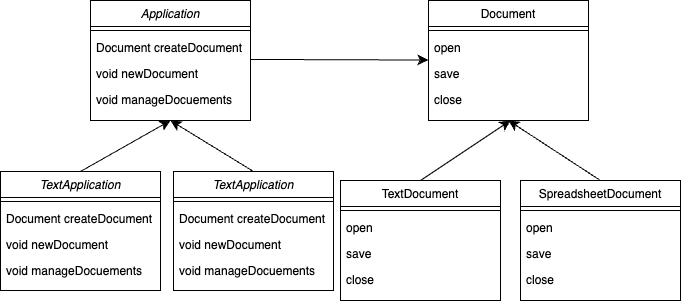

# 팩토리 메서드란?

## 0. 생성 패턴

- 기존의 코드 유연성과 재사용성 증가시키는 다양한 객체 생성 메커니즘을 제공
- 종류
    - `팩토리 메서드`
    - `추상 팩토리`
    - `빌더`
    - `프로토 타입`
    - `싱글톤`

## 1. 팩토리 메서드

- 객체 생성을 서브클래스에 위임하는 디자인 패턴
- `팩토리 메서드를 사용하여 객체를 생성`
- 생성될 객체의 클래스를 클라이언트 코드에서 직접 지정하지 않고 `서브(구현) 클래스`에서 지정

## 2. 팩토리 메서드 예제 코드

### 2.1 예제 코드 다이어그램



### 2.2 구체적인 인터페이스 정의

```java
// 문서 인터페이스 정의
interface Document {
    void open();
    void save();
    void close();
}
```

### 2.3 구체적인 문서 클래스

```java
class TextDocument implements Document {
    public void open() {
        System.out.println("텍스트 문서 열기");
    }

    public void save() {
        System.out.println("텍스트 문서 저장");
    }

    public void close() {
        System.out.println("텍스트 문서 닫기");
    }
}

class SpreadsheetDocument implements Document {
    public void open() {
        System.out.println("스프레드시트 문서 열기");
    }

    public void save() {
        System.out.println("스프레드시트 문서 저장");
    }

    public void close() {
        System.out.println("스프레드시트 문서 닫기");
    }
}
```

### 2.4 팩토리 메소드를 정의하는 추상 클래스

```java
abstract class Application {
    // 팩토리 메서드
    protected abstract Document createDocument();
    
    // 비즈니스 로직
    public void newDocument() {
        Document doc = createDocument();
        doc.open();
        doc.save();
        doc.close();
    }

    // 기타 비즈니스 로직
    public void manageDocuments() {
        System.out.println("문서 관리 로직 수행");
    }
}
```

### 2.5 구체적인 팩토리 클래스

```java
class TextApplication extends Application {
    @Override
    protected Document createDocument() {
        return new TextDocument();
    }
    ...
}

class SpreadsheetApplication extends Application {
    @Override
    public Document createDocument() {
        return new SpreadsheetDocument();
    }
    ...
}
```

### 2.6 클라이언트 코드

```java
public class Main {
    public static void main(String[] args) {
        Application app = new TextApplication();
        app.newDocument();
        app.manageDocuments();  // 기타 비즈니스 로직 수행

        app = new SpreadsheetApplication();
        app.newDocument();
        app.manageDocuments();  // 기타 비즈니스 로직 수행
    }
}
```

- `Document`
    - 문서를 추상화 하는 인터페이스
    - `TextDocument`, `Spreadsheet`: `Document`의 서브(구현) 클래스
- `Applicaiton`
    - 문서 어플리케이션 클래스, 아래 두 역할을 하는 추상 클래스
        - `Document` 객체를 생성하는 팩토리 메서드 정의 → 서브 클래스에 위임
        - `Document`를 사용하는 비지니스 로직 포함
    - `TextApplication`, `SpreadsheetApplication`: `Application`의 서브(구현) 클래스

## 3. 위 코드의 확장 예제

- 예를 들어, Presentation 타입 문서가 추가 되었을 때

```java
// 추가적인 문서 클래스
class PresentationDocument implements Document {
    public void open() {
        System.out.println("프레젠테이션 문서 열기");
    }

    public void save() {
        System.out.println("프레젠테이션 문서 저장");
    }

    public void close() {
        System.out.println("프레젠테이션 문서 닫기");
    }
}

// 추가적인 문서 어플리케이션 클래스
class PresentationApplication extends Application {
    @Override
    protected Document createDocument() {
        return new PresentationDocument();
    }
    // 추가적인 비즈니스 로직 구현 가능
}
```

## 4. 팩토리 메서드의 장점

- 유연성
- 응집도 증가 (결합도 감소)
- SRP, OCP 준수

## 5. 팩토리 메서드의 단점

- 팩토리 메서드 구현을 위해 많은 서브(구현) 클래스가 필요하다.

## Reference

- https://refactoring.guru/ko/design-patterns/factory-method