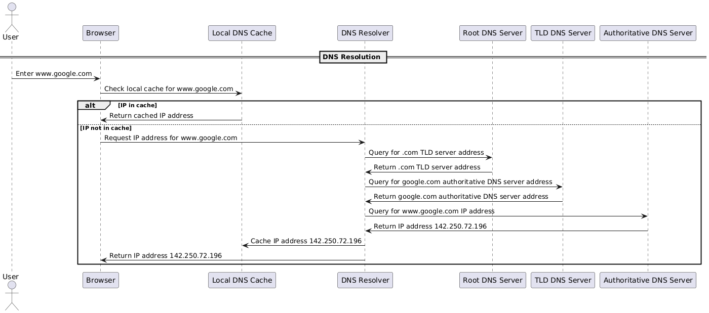
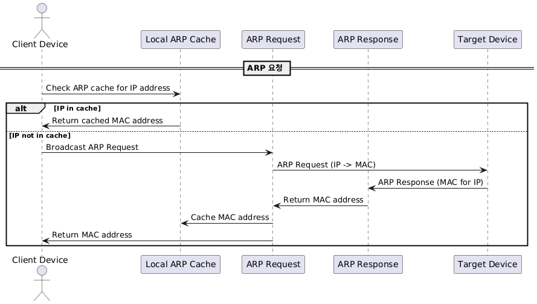
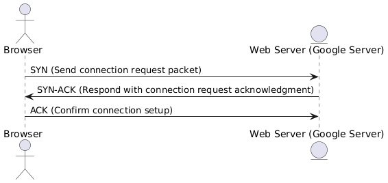
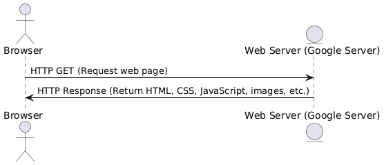
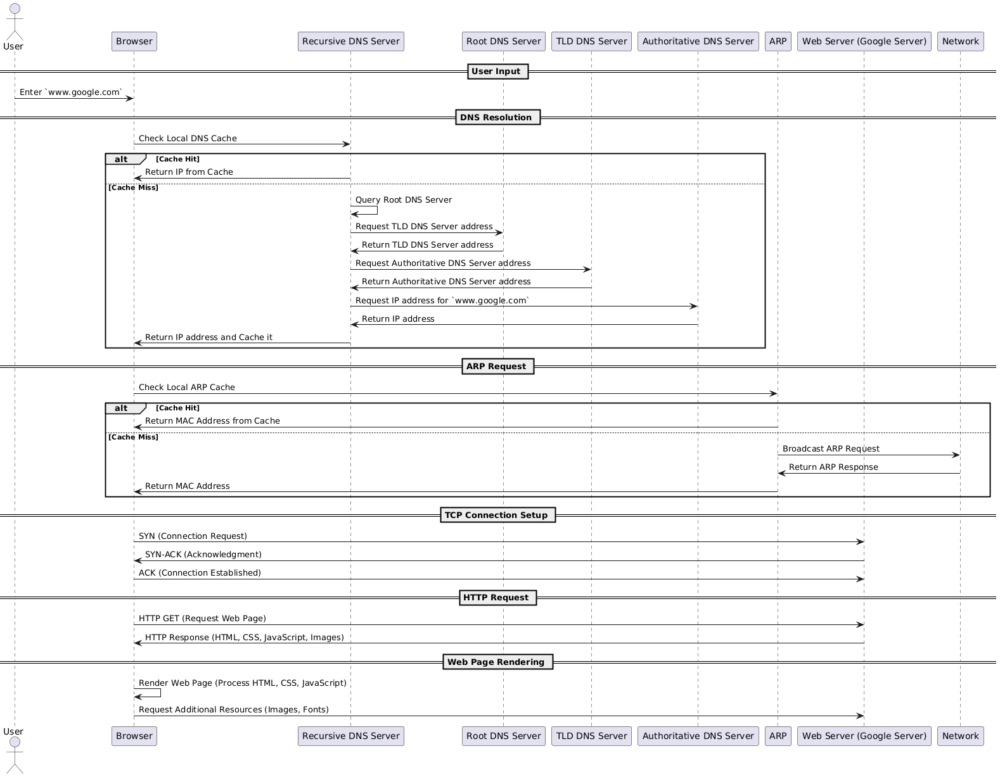

# 웹 페이지 요청 과정

## `www.google.com` 입력 시 일어나는 일

### 1. 사용자 입력

- **브라우저에서 `www.google.com` 입력**
    - 사용자가 웹 브라우저의 주소창에 도메인 입력.
    - 브라우저는 이를 통해 HTTP 요청을 전송하여 웹 페이지를 로드하려고 함.
    - 기본 포트는 80번으로 설정: `http://www.google.com:80`

### 2. DNS 조회



1. **로컬 캐시 검색**
    - **브라우저**는 먼저 로컬 DNS 캐시를 확인하여 `www.google.com`의 IP 주소가 저장되어 있는지 확인
        - **캐시가 존재하는 경우:** 브라우저는 캐시된 IP 주소를 사용
        - **캐시가 존재하지 않는 경우:** 브라우저는 재귀적 DNS 서버에 IP 주소를 요청
2. **재귀적 DNS 서버 요청**
    - **로컬 캐시에 IP 주소가 없는 경우,** 브라우저는 **재귀적 DNS 서버**에 IP 주소를 요청
    1. **루트 DNS 서버 쿼리**
        - **재귀적 DNS 서버**는 루트 DNS 서버에 쿼리 보냄
        - 루트 DNS 서버는 최상위 도메인(TLD) 서버의 주소 반환
    2. **TLD DNS 서버 쿼리**
        - **재귀적 DNS 서버**는 루트 DNS 서버의 응답을 바탕으로 TLD DNS 서버에 쿼리를 보냄
        - TLD DNS 서버는 도메인 이름의 권한 있는 DNS 서버의 주소를 반환
    3. **권한 있는 DNS 서버 쿼리**
        - **재귀적 DNS 서버**는 TLD DNS 서버의 응답을 바탕으로 권한 있는 DNS 서버에 쿼리를 보냄
        - 권한 있는 DNS 서버는 도메인 이름에 대한 실제 IP 주소를 반환
    4. **IP 주소 반환**
        - 권한 있는 DNS 서버가 IP 주소를 반환하면, **재귀적 DNS 서버**는 이 정보를 로컬 캐시에 저장한 후, 브라우저에 IP 주소를 반환
- 용어
    - `IP addreess(Internet Protocol address)`
        - OSI 7 Layer에서 3계층에서 사용되는 논리적 주소, 인터넷과 네트워크 사이에서 장치를 식별하는데 사용
            - IPv4: 192.168.1.1 → 32비트
            - IPv6: 2001:0db8:85a3:0000:0000:8a2e:0370:7334 → 128비트
    - `DNS(Domain Name System)`
        - 도메인 이름을 IP 주소로 변환하는 시스템, 이는 사용자가 웹사이트에 접근할 때 도메인 이름(`www.google.com`)을 해당 웹사이트의 IP 주소로 변환하여 웹 페이지를 요청 가능하게 함
    - `DNS Resolver`
        - DNS 쿼리를 처리하고 응답을 반환하는 서버 또는 소프트웨어
        - 재귀적 DNS 서버라고도 하며, 클라이언트의 요청을 받아 도메인 이름을 IP 주소로 변환하기 위해 필요한 모든 DNS 쿼리를 수행

### 3. ARP 요청



- **IP 주소를 MAC 주소로 변환**
    - **로컬 ARP 캐시 검색:**
        - 로컬 ARP 캐시를 확인, IP 주소에 해당하는 MAC 주소가 저장되어 있는지 검사
            - **캐시에 MAC 주소가 있는 경우:** 로컬 ARP 캐시에서 MAC 주소를 반환
            - **캐시에 MAC 주소가 없는 경우:** ARP 요청을 브로드캐스트
    - **ARP 요청:**
        - IP 주소에 대한 MAC 주소를 찾기 위해 네트워크에 **ARP 요청** 패킷을 브로드캐스트
        - **ARP 요청** 패킷은 네트워크 내 모든 장치로 전송
    - **ARP 응답:**
        - **타겟 장치**는 ARP 요청을 수신하고, 요청된 IP 주소에 해당하는 자신의 MAC 주소를 포함한 **ARP 응답** 패킷을 전송
        - **ARP 응답** 패킷은 ARP 요청을 보낸 **클라이언트**에 전송됩니다.
    - **응답 처리:**
        - **ARP 요청**은 **ARP 응답**에서 반환된 MAC 주소를 **로컬 ARP 캐시**에 저장
        - **ARP 요청**은 **클라이언트**에 MAC 주소를 반환
- 용어
    - `MAC Address(Media Access Control Address)`
        - OSI 7 Layer 에서 2계층인 데이터 링크 계층에서 사용되는 물리적 주소, 네트워크 인터페이스 카드에 할당되는 고유한 6바이트 길이의 주소
            - 예시) 00:1A:2B:3C:4D:5E
    - `ARP(Address Resolution Protocol)`
        - 네트워크에서 IP 주소를 물리적 MAC 주소로 변환하는 프로토콜

### 4. TCP 연결 설정



- **TCP 3-way 핸드셰이크**
    - 웹 서버(google server)와의 연결을 설정하기 위해 TCP 3-way 핸드셰이크를 수행:
        1. **SYN:** 브라우저가 웹 서버에 연결 요청 패킷 전송
        2. **SYN-ACK:** 웹 서버가 브라우저의 요청에 대한 응답으로 SYN-ACK 패킷 전송
        3. **ACK:** 브라우저가 웹 서버의 응답을 확인하고, 연결이 설정

### 5. HTTP 요청



- **HTTP GET 요청**
    - TCP 연결이 설정되면, 브라우저는 웹 서버에 HTTP GET 요청을 전송
    - `www.google.com` 웹 페이지의 HTML 콘텐츠를 요청
        
        ```bash
        GET / HTTP/1.1
        Host: www.google.com
        User-Agent: Mozilla/5.0 (Windows NT 10.0; Win64; x64) AppleWebKit/537.36 (KHTML, like Gecko) Chrome/91.0.4472.124 Safari/537.36
        Accept: text/html,application/xhtml+xml,application/xml;q=0.9,image/webp,image/apng,*/*;q=0.8
        Accept-Language: en-US,en;q=0.9
        Connection: keep-alive
        ```
        

- **웹 서버 응답**
    - 웹 서버는 요청을 처리하고, HTTP 응답을 브라우저에 반환
    - 요청한 웹 페이지의 HTML, CSS, JavaScript, 이미지 등 다양한 자원이 포함
        
        ```bash
        HTTP/1.1 200 OK
        Date: Tue, 21 Aug 2024 12:00:00 GMT
        Server: gws
        Content-Type: text/html; charset=UTF-8
        Content-Encoding: gzip
        Content-Length: 12345
        Connection: close
        
        <!DOCTYPE html>
        <html>
        <head>
            <title>Google</title>
            <style>
                /* CSS 스타일 여기 */
            </style>
            <script>
                // JavaScript 코드 여기
            </script>
        </head>
        <body>
            <h1>Google에 오신 것을 환영합니다</h1>
            <p>웹 페이지, 이미지, 비디오 등 세상의 정보를 검색하세요.</p>
            
        </body>
        </html>
        ```
        

### 6. 웹 페이지 렌더링

- **브라우저 처리**
    - 브라우저는 받은 HTML, CSS, JavaScript 파일을 처리하여 웹 페이지를 렌더링
    - 추가로 필요한 자원 (이미지, 폰트 등)을 요청하여 페이지를 완전히 로드

## 요약



1. 사용자 입력
2. DNS 조회
3. ARP 요청
4. TCP 연결
5. HTTP 요청
6. 웹 페이지 렌더링